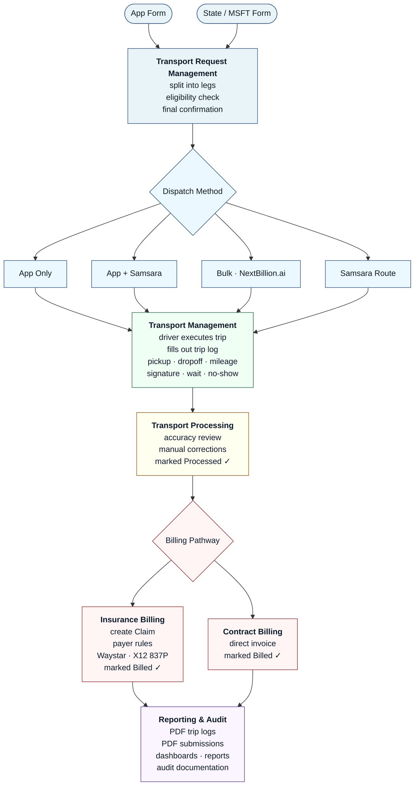

<!-- Slide separator: --- -->

# Echo1 V2 — Kickoff

## Welcome to the Team

March 19, 2026

---

<!-- ============================================ -->
<!-- PART 1: PVRAGON ORIENTATION (30 min)         -->
<!-- ============================================ -->

# Part 1: Pvragon Orientation

---

## How We Work at Pvragon

**Basic Expectations** — read the full doc, but the short version:

- Deliver what you commit to. Communicate early if something slips.  Communicate often throughout the day via 'notifications'.
- Be available during your agreed working hours. Respond within a reasonable window.
- Track your time daily in Kimai — it's how the business runs.
- Take PTO when you need it. Follow the OOO process in Google Calendar.

> [Basic Expectations Doc](https://docs.google.com/document/d/1dbRW3nArlpghE97yanNgVjuzTx-ljzqK9461Gs8bpB0/edit?usp=sharing) · [Employee Handbook](https://drive.google.com/file/d/1YjycbCYVl9ow4h5OqhrR9sam6EWozsbY/view?usp=sharing) · [PTO Policy](https://docs.google.com/presentation/d/1c6D8EoueZGt0mg4T5NKasFW6i6zKkML0E-5ONSdJ_-4/edit?slide=id.g31503ba996f_0_44)

---

## Key Tools & Accounts

| Tool | What It's For | Link |
|------|---------------|------|
| **ClickUp** | Communication, task management, docs, wiki | [Dev Space](https://app.clickup.com/9011906822/v/s/90113808223) |
| **Kimai** | Time tracking (daily) | [kimai.pvragon.com](https://kimai.pvragon.com/en/login) |
| **GitHub** | Code, PRs, CI/CD | Pvragon org |
| **Vaultwarden** | Passwords & secrets | [pw.pvragon.com](https://pw.pvragon.com/#/login) |
| **Google Workspace** | Email, Calendar, Drive | `@pvragon.com` |
| **Claude Max** | AI-assisted development | Subscription provided |
| **Figma** | Design mocks & UX flows | View access |

---

## Kimai Demo

**Areeba Akhlaque** — walkthrough

- Logging in
- Selecting the right project / activity
- Starting and stopping timers
- Daily logging expectations
- Where to go if something looks wrong

---

## Communication Norms

**ClickUp is home base.** Chat, tasks, docs — everything lives there. Async-first — we span Pacific to Asia.

Slack is only used for communication with Softstackers (infra support team). Everything else is in ClickUp.

| What | How | Cadence |
|------|-----|---------|
| Quick questions, updates | ClickUp Chat (relevant channel) | Anytime |
| Notifications | ClickUp — post what you're working on, what you finished, what's blocked | Throughout the day |
| Daily sync | Standup (Dana runs) | Daily, 30 min |
| Weekly accountability | Targets committed Mon, reported Fri | Weekly |
| Blockers & escalations | ClickUp → pod lead → Dana → Jaime | Within 24 hours |
| Architecture decisions | ClickUp doc or thread → Jaime review | As needed |

**Escalation rule:** If a decision or blocker can't be resolved within 24 hours between the people involved, escalate. Don't sit on it.

---

## Meeting Times & Frequency

**This is a group discussion — not a decree.**

Our timezone spread:

| Cluster | People | UTC Offset |
|---------|--------|------------|
| Pacific (US/Canada) | Roman, Victor, Dana | UTC-7 |
| Near-Pacific (LATAM) | JP, David, Rafael, Saymond | UTC-4 to UTC-6 |
| Near-Pacific (Brazil) | Clarissa | UTC-3 |
| Europe | Alex | UTC+2 |
| Asia | Farhan, Bilal, Adriane | UTC+5 to UTC+8 |

**Questions to decide together:**

- What time works for a daily standup that most people can attend live?
- What other meetings besides standup are needed?  Team level, group level, 1:1s, etc?
- What meetings are mandatory-sync vs. recorded-and-async?
- Who follows up on Gemini notes - Rotating, or assigned to Delivery Manager (April+)?

---

<!-- ============================================ -->
<!-- PART 2: RIDE CARE CONTEXT (30 min)           -->
<!-- ============================================ -->

# Part 2: Ride Care Context

---

## Who is Ride Care?

**Ride Care Transportation** — behavioral and mental health transportation provider

- Founded 2021, Oklahoma-based
- ~120 vehicles, ~120 drivers
- 10,000+ rides per month
- 24/7 dispatch — three shifts, ~30 dispatchers
- Owned by David Roberts Consulting (DRC)

### Programs

| Program | Type | Volume |
|---------|------|--------|
| **Crisis** | Immediate / same-day | High urgency, lower volume |
| **Pre-scheduled** | Recurring appointments | Highest volume |
| **TANF** | Welfare-to-work | State-funded, specific rules |

---

## What We're Building

**Echo1** is the V2 platform — a ground-up rebuild of Ride Care's operations system.

| | V1 (Current) | V2 (Echo1) |
|---|---|---|
| **Platform** | Backendless (no-code) | Next.js, Fastify, GraphQL Yoga |
| **Database** | Backendless DB | Aurora PostgreSQL |
| **Hosting** | Backendless Cloud | AWS Fargate |
| **Auth** | Backendless | Cognito |
| **Caching** | None | Valkey (Redis-compatible) |
| **Multi-tenant** | No | Yes — Ride Care is anchor tenant |
| **HIPAA** | Partial | Full compliance target |

**Why rebuild?** Scalability limits, compliance gaps, vendor lock-in, no path to multi-tenant.

---

## The Core Domain: Lifecycle of a Transport

Everything in the app touches some part of this pipeline.

There are six stages from request to historical record.

---

## Stage 1: Request Intake

A transport request enters through one of two channels:

```
┌─────────────────┐     ┌──────────────────┐
│   App Form       │     │   State Form      │
│  (facility /     │     │  (e.g., MSFT      │
│   coordinator)   │     │   submission)     │
└────────┬────────┘     └────────┬──────────┘
         │                       │
         └───────────┬───────────┘
                     ▼
         ┌───────────────────────┐
         │   Transport Request   │
         └───────────┬───────────┘
                     ▼
            Split into Legs
    (if multi-stop trip or return trip)
                     ▼
           Eligibility Check
                     ▼
          Final Confirmation
     (can include phone call to client)
```

### Transport Request States

| State | Meaning |
|-------|---------|
| **Undispatched** | Confirmed and waiting for driver assignment |
| **Voided** | Cancelled before dispatch (never assigned) |
| **Dispatched** | Assigned to a driver — becomes a Transport |

---

## Stage 2: Dispatch

A confirmed request gets assigned to a driver. Four methods:

| Method | When Used |
|--------|-----------|
| **App only** | Single ride, manual assignment through dispatch UI |
| **App + Samsara** | Single ride with real-time GPS tracking and driver notification |
| **Bulk via NextBillion.ai** | Batch route optimization for pre-scheduled transports (next-day planning) |
| **Samsara route** | Driver receives a pre-built multi-stop route dispatched via the app |
| **Manual Samsara route** | Dispatchers go to Samsara and dispatch without the app - we want to avoid this |

**Dispatching creates a Transport record** — this is the operational entity that tracks the ride through its entire lifecycle.

---

## Stage 3: Execution + Trip Log

The driver is now on the road.

While executing the transport, the driver fills out a **trip log** in the app:

- Pickup time
- Drop-off time
- Mileage
- Wait times
- Passenger signature
- No-show status

These values attach directly to the **Transport** record.

### Transport States

| State | Meaning |
|-------|---------|
| **In Progress** | Driver is actively executing |
| **Voided** | Nullified (e.g., system error, duplicate, cancelled before driver left) |
| **Cancelled** | Cancelled after the driver has started (i.e. billable costs incurred) |
| **Completed** | Driver finished — trip log submitted |

---

## Stage 4: Review + Processing

The dispatch team reviews the completed Transport for accuracy.

**What they're checking:**

- Times match reality (pickup, drop-off, wait)
- Mileage is correct
- Cancellation status is accurate
- Notes are complete
- Any discrepancies are manually corrected

Once the record is verified and fully tracked → marked **Processed**.

```
Completed → Dispatch Review → Manual Corrections → Processed
```

---

## Stage 5: Billing + Claims

The billing team receives Processed transport records.

```
Processed Transports
        ▼
  ┌─────────────┐
  │ Create Claim │ ← Payer-specific rules
  │   entity     │   (program, service codes,
  └──────┬──────┘    modifiers, rates)
         ▼
  Submit to Clearinghouse
       (Waystar)
    as X12 837P EDI
         ▼
  Acceptance / Rejection
    guidance returned
         ▼
  Claim + Transports
   marked "Billed"
```

**Key entities:** One **Claim** may contain multiple **Transport** records (e.g., a round-trip with two legs).

---

## Stage 6: Historical Record + Analytics

Once billed, the Transport is a matter of historical record.

It feeds into:

| Output | Purpose |
|--------|---------|
| **PDF trip logs** | Archival, audit trail |
| **PDF submission records** | Proof of claim submission |
| **Dashboards** | Ops metrics — rides/day, on-time %, utilization |
| **Counts & reports** | Program-level volume, driver productivity, facility usage |
| **Audit documentation** | State and payer compliance audits |

---

## The Full Pipeline



---

## Self-Study Before Tomorrow

| Resource | Priority | Link |
|----------|----------|------|
| RideCare User Video Series | **High** | [YouTube Playlist](https://www.youtube.com/playlist?list=PLOVZEsiZHQu5ttFzQWOGDkHfZnARlCIuB) |
| Your individual role description | **High** | Sent via email |
| Pvragon Basic Expectations | **High** | [Google Doc](https://docs.google.com/document/d/1dbRW3nArlpghE97yanNgVjuzTx-ljzqK9461Gs8bpB0/edit?usp=sharing) |
| RideCare Dev Team onboarding guide | **High** | [ClickUp Wiki](https://app.clickup.com/9011906822/docs/8cjdj86-1131/8cjdj86-2251) |
| Figma UX / Product Design flows | Medium | [Figma Board](https://www.figma.com/board/lnw5bQpXGsBzwsOdN9oe3h/UX---Product-Design) |
| Ride Care App Mocks | Medium | [Figma Design](https://www.figma.com/design/rS57HuqejF4AWeghqB9Luy/OKRC-Mocks) |
| Dispatch Training Videos | Context | [SharePoint](https://okridecare.sharepoint.com/sites/DispatchLearningCenter/Dispatch%20Training%20Videos/Forms/All%20media.aspx) |

**Tomorrow:** Team Structure + Roles & Responsibilities

---

## Key Links — Bookmark These

| Resource | Link |
|----------|------|
| ClickUp Dev Space | [app.clickup.com/…/90113808223](https://app.clickup.com/9011906822/v/s/90113808223) |
| Company Wiki — Resources & Key Links | [ClickUp Doc](https://app.clickup.com/9011906822/docs/8cjdj86-1131/8cjdj86-2231) |
| RideCare Dev Team Onboarding | [ClickUp Doc](https://app.clickup.com/9011906822/docs/8cjdj86-1131/8cjdj86-2251) |
| Ride Care Shared Drive | [Google Drive](https://drive.google.com/drive/u/0/folders/0AEfdDKpJcIWJUk9PVA) |
| DevOps Folder | [Google Drive](https://drive.google.com/drive/folders/1at8VFCE2V-ahSv5hO5x7rPqteTHXVKq5?usp=drive_link) |
| Figma — Product Design | [Figma Board](https://www.figma.com/board/lnw5bQpXGsBzwsOdN9oe3h/UX---Product-Design) |
| Figma — Ride Care Mocks | [Figma Design](https://www.figma.com/design/rS57HuqejF4AWeghqB9Luy/OKRC-Mocks) |
| Kimai (Time Tracking) | [kimai.pvragon.com](https://kimai.pvragon.com/en/login) |
| Vaultwarden (Passwords) | [pw.pvragon.com](https://pw.pvragon.com/#/login) |
| Pvragon Loom | [loom.com/spaces/Pvragon](https://www.loom.com/spaces/Pvragon-33037068) |
