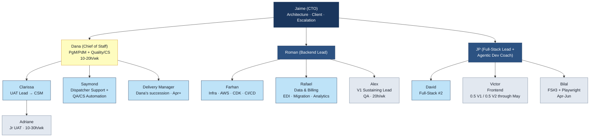

<!-- Slide separator: --- -->

# Echo1 V2 — Team Structure

## Roles & Responsibilities

March 20, 2026

---

# How We're Organized

Three pods, three leads, one CTO.

---

## The Three-Pod Model

| Pod | Lead | Focus | Members |
|-----|------|-------|---------|
| **Roman Pod** | Roman Naidenko | Backend engineering | Farhan, Rafael, Alex |
| **JP Pod** | JP Casabianca | Frontend + full-stack + agentic dev | David, Victor, Bilal |
| **Dana Pod** | Dana Hetté | Program management + quality/CS | Clarissa, Saymond, Adriane, DM (Apr+) |

Jaime sits above all three pods — architecture authority, client relationship, final escalation.

---

## Org Chart

```
                               Jaime (CTO)
                Architecture, client relationship, final escalation
                                   |
              +--------------------+--------------------+
              |                    |                    |
            Dana                Roman                  JP
       (Chief of Staff /     (Backend Lead)        (Full-Stack Lead +
        Sr PgM/PdM +               |               Agentic Dev Coach)
        Quality/CS)                |                      |
        10-20h/wk                  |                      |
              |             +------+------+         +-----+-----+
      +-------+------+     |      |      |         |     |     |
      |    |    |    |   Farhan Rafael  Alex      David Victor Bilal
    Clar- Say- Adri- DM  Infra  Data & V1 Sust.  FS#2  Front  FS#3 +
    issa  mond ane  Apr+  AWS   Billing Lead+QA         end   Playwright
    UAT   CS+       CDK   EDI,   20h/wk                      Apr-Jun
    Lead  Auto      CI/CD migr,
      |   Engr            anlyt
   Adriane
```

---

## Org Chart (Visual)



---

<!-- ============================================ -->
<!-- ROMAN POD                                     -->
<!-- ============================================ -->

# Roman Pod — Backend Engineering

---

## Roman Naidenko — Backend Lead

**Owns everything server-side.**

| Domain | Scope |
|--------|-------|
| Database & schema | PostgreSQL, Drizzle ORM, RLS policies, migrations |
| API layer | GraphQL resolvers, server-side business logic |
| Core domain logic | Samsara integration, dispatch workflow, driver planning, NextBillion.ai |
| Infrastructure direction | Farhan executes, Roman directs |
| Data & billing direction | Rafael executes, Roman directs |

**Direct reports:** Farhan, Rafael, Alex — all senior, all self-directing.

---

## Farhan — Infrastructure Engineer

**Owns:** AWS infrastructure. CDK. VPC and networking. ECS Fargate. Aurora PostgreSQL ops. Valkey. CI/CD (GitHub Actions → ECR → ECS). CloudWatch. Secrets Manager. HIPAA compliance controls.

**Reports to:** Roman (application requirements) + Jaime (architecture-level review)

**Week 1 priority:** CDK foundation in dependency order — VPC + networking first, then RDS + Valkey, then ECS + deploy pipeline. Cognito in parallel.

---

## Rafael — Data & Billing Engineer

**Owns:** X12 837P/835 EDI billing engine. Data migration ETL (V1 → V2). Analytics dashboard queries. Waystar clearinghouse integration.

**Reports to:** Roman

**Weeks 1-2 priority:** RLS validation — the single most important de-risking activity in the project. Stack onboarding (TypeScript/Node.js, Drizzle ORM) in parallel.

**Background:** Chargeback ingestion (Protego, YC S21), analytics pipelines (Linnda), ETL (SellersFunding). Same pattern as claims processing — different vocabulary.

---

## Alex — V1 Sustaining Lead + QA

**Owns:** V1 day-to-day engineering — bug bashing, QA, minor fixes, DB monitoring. After May: primary QA engineer for V2.

**Reports to:** Roman (light touch)

**Hours:** 20h/wk (hard cap). Handles 80-90% of V1 issues independently.

**V1 escalation chain:** Alex → Roman → Jaime

---

<!-- ============================================ -->
<!-- JP POD                                        -->
<!-- ============================================ -->

# JP Pod — Frontend + Full-Stack

---

## JP Casabianca — Full-Stack Lead + Agentic Dev Coach

**Owns the client-side build + sets agentic development patterns for the entire team.**

| Domain | Scope |
|--------|-------|
| Frontend architecture | React 19, Next.js App Router, Server Components, SSR/CSR boundary |
| Component patterns | Shadcn/ui, AG Grid, Tailwind theming, white-label |
| Monorepo structure | Workspace layout, build config, package conventions |
| Agentic development | Workflow patterns, multi-agent coordination, team AI tooling standards |
| Code review | Frontend + full-stack PRs |

**Direct reports:** David, Victor, Bilal (Apr-Jun)

---

## David Perez — Full-Stack Engineer #2

**Owns:** Feature development across the full stack, within JP's architectural patterns.

**Reports to:** JP

**Week 1:** Pairs with JP on monorepo scaffold. Learns V2 stack patterns.

**Backend questions go directly to Roman** — no need to route through JP.

---

## Victor Cheung — Frontend Engineer

**Owns:** Frontend UI implementation — Shadcn/ui components, AG Grid views, form implementations, responsive design, accessibility.

**Reports to:** JP

**Split:** 0.5 V1 / 0.5 V2 through May. 100% V2 after cutover.

**Weeks 1-2 (V2):** Design system component implementation — layout shell, page wrapper, form container, data grid wrapper, mobile responsive container, error boundary.

**When V1 and V2 conflict:** Dana makes the priority call.

---

## Bilal Mughal — FS#3 + Playwright (Apr-Jun)

**March:** V1 wrap-up under Roman. DB monitoring handoff to Alex.

**April-June:** Transitions to JP's pod. Feature development + embedded Playwright E2E tests.

**Decision gate:** End of March — if V1 performance doesn't justify keeping him, exit and fill with a JP referral.

**Exits end of June.**

---

<!-- ============================================ -->
<!-- DANA POD                                      -->
<!-- ============================================ -->

# Dana Pod — Program Management + Quality/CS

---

## Dana Hetté — Chief of Staff (Fractional)

**Owns process authority across the entire team.**

| Domain | Scope |
|--------|-------|
| Program management | Standups, sprint planning, milestone tracking, schedule risk |
| Priority enforcement | "What gets worked on when" |
| Quality triage | Routes Clarissa's findings to the right engineer |
| Internal translation | Customer needs → actionable specs for engineering |
| Delivery succession | Training her replacement (DM hire, April+) |

**Does NOT own:** Technical decisions, code review, architecture, task assignment within pods.

**Hours:** 10-20h/wk. Exits end of July.

---

## Clarissa Carvalho — UAT Lead → CSM

**Owns:** User acceptance testing. Exhaustive V2 validation against customer workflows. Mentoring Adriane.

**Reports to:** Dana

**Post-launch:** Transitions to Customer Success Manager — primary non-technical relationship contact for RideCare's operational team.

**Quality feedback loop:**

```
Clarissa finds defect → Dana triages → routes to Roman or JP → engineers fix → Clarissa validates
```

---

## Saymond Montoya — Dispatcher Support + QA/CS Automation

**Owns:** Customer support for RideCare dispatchers. Release coordination. QA/CS workflow automation.

**Reports to:** Dana. Technical escalations cross to Roman (backend) or Victor (frontend).

| Phase | CS Work | Automation Work | Split |
|-------|---------|-----------------|-------|
| **March** | Dispatcher support, release mgmt | — | 100/0 |
| **April-May** | CS lead, QA coordination | Playwright scripts, CS automation | 60/40 |
| **June+** | Tier 2 helpdesk | UAT tooling, intake automation, reports | 50/50 |

**Growth path:** Agentic automation engineer (not PdM/PgM).

---

## Adriane & Delivery Manager

**Adriane Barredo** — Junior UAT / CS Support

- Reports to Clarissa (under Dana)
- 10h/wk (Mar) → 20h/wk (Apr) → 30h/wk (May) → tapers post-cutover
- Frees Saymond's bandwidth for automation work

**Delivery Manager (TBD)** — Dana's Succession

- Target start: April
- 5-8 years software delivery experience
- Learns under Dana (April-July), takes over when Dana exits
- Handles: ClickUp updates, standup notes, UAT scheduling, feedback routing

---

<!-- ============================================ -->
<!-- DOMAIN OWNERSHIP                              -->
<!-- ============================================ -->

# Domain Ownership

## "Who do I go to for X?"

---

## Decision Authority Table

| Decision Type | Owner |
|---------------|-------|
| "How should this feature work?" (business logic) | **Roman** |
| "How should this UI be built?" | **JP** |
| "How should this be deployed/secured?" | **Roman** → Farhan executes |
| "How should billing/EDI work?" | **Roman** (rules) → Rafael (implementation) |
| "Should we build this at all?" | **Dana** (priority) + Jaime (architecture) |
| GraphQL schema design | **Roman** (server) + **JP** (client) — Jaime arbitrates |
| Database schema changes | **Roman** (authority) |
| Infra architecture decisions | Farhan proposes → Roman reviews → **Jaime** approves |
| Agentic workflow patterns | **JP** (authority) |
| Data migration | Roman (mappings) → **Rafael** (ETL) → Alex (validates) |

---

## Key Boundaries

### Roman ↔ JP

**The GraphQL schema is the handoff point.**

- Roman owns what resolvers return
- JP owns how the UI consumes it
- Schema design is collaborative — disputes go to Jaime
- If Jaime can't resolve within 24 hours → joint decision, documented

### Roman ↔ Farhan

**Requirements vs. implementation.**

- Roman says "the app needs X" (WebSocket support, connection pooling for RLS)
- Farhan decides how to deliver it on AWS
- Roman does NOT review VPC designs or CDK patterns
- Jaime reviews architecture-level infra decisions

### Dana ↔ Engineering

**What vs. how.**

- Dana decides what gets worked on when (priority)
- Roman and JP decide how it gets built (technical)
- If a pod lead disagrees with a priority call → escalate to Jaime
- Pod leads do NOT unilaterally override Dana's prioritization

---

<!-- ============================================ -->
<!-- CTO ABSENCE PROTOCOL                          -->
<!-- ============================================ -->

# CTO Absence Protocol

---

## When Jaime Is Unavailable

Jaime is a single point of failure for architecture, client relationship, and final escalation. Here's who covers what:

| Domain | Normal Owner | Covered By | Authority |
|--------|-------------|------------|-----------|
| Backend architecture | Jaime approves | **Roman** decides | Full authority. Notify Jaime async. |
| Frontend architecture | Jaime approves | **JP** decides | Full authority. Notify Jaime async. |
| Cross-cutting (Roman/JP disagree) | Jaime arbitrates | **Roman + JP** joint decision | Document it. Jaime reviews within 48h. |
| Sprint priorities | Jaime is final escalation | **Dana** decides | Full authority. Jaime reviews weekly. |
| Client relationship | Jaime owns | **Dana** for status updates | Cannot make contractual or strategic commitments. |
| Hiring decisions | Jaime decides | **Wait for Jaime** | No delegation — irreversible decisions. |
| Infrastructure | Jaime approves | Farhan proposes, **Roman** reviews | Roman approves non-HIPAA changes. HIPAA changes wait. |

**Rule:** If Jaime is unreachable for >24 hours during an active sprint, Dana assumes coordination authority and Roman/JP proceed with technical decisions in their domains.

**The sprint doesn't wait.**

---

<!-- ============================================ -->
<!-- V1 SUSTAINING                                 -->
<!-- ============================================ -->

# V1 Sustaining Team

---

## V1 Is Still Running

V1 is a live 24/7 production system — 10K+ rides/month, ~120 drivers, 20-30 dispatchers.

V1 support is NOT a separate org. It's an allocation of people who exist in the V2 structure.

| Person | V1 Role | V1 Hours | Notes |
|--------|---------|----------|-------|
| **Alex** | V1 sustaining lead — bugs, QA, minor fixes | 20h/wk (full allocation) | Self-directing |
| **Victor** | Minor feature dev, UI/component fixes | ~0.5 FTE through May | Moves 100% V2 post-cutover |
| **Saymond** | CS lead + QA/CS automation | ~0.75 FTE on CS | Technical escalations → Roman/Victor |
| **Adriane** | CS support — frees Saymond bandwidth | 10→30 h/wk | Ramps as Clarissa arrives |
| **Bilal** | V1 wrap-up (March only) | 1.0 FTE | Transitions to FS#3 under JP in April |
| **Roman** | V1 escalation path | As needed | Only for deep app-logic bugs |

**Escalation chain:** Alex → Roman → Jaime

**Nobody new touches V1.** JP, David, Rafael — V2 only.

---

<!-- ============================================ -->
<!-- TEAM PROCESS                                   -->
<!-- ============================================ -->

# How We Work Together

---

## Daily Process

| What | How | Cadence |
|------|-----|---------|
| **Standups** | Dana runs. All pod leads + active sprint members. | Daily, 30 min |
| **Weekly targets** | Pods commit Monday, report Friday. | Weekly |
| **Throughput check** | If any pod's throughput drops 2+ days without a stated blocker, Dana flags. | Ongoing |
| **Escalation** | If a blocker can't be resolved in 24 hours → escalate to Jaime. | As needed |

**Escalation default:** Blocker > 24 hours → pod lead or Dana unblocks. If neither can → Jaime.

---

## Team Transitions (Known)

| Person | Change | When | What Happens |
|--------|--------|------|--------------|
| Bilal | March → April transition | End of March gate | V1 wrap-up → FS#3 under JP (if gate passes) |
| Victor | V1/V2 split → V2 only | Post-cutover (~June) | 100% V2 |
| Clarissa | UAT Lead → CSM | Post-cutover | Customer success role |
| Bilal | Exits | End of June | Sprint complete |
| Rafael | Exits (project-basis) | End of July | Available for re-engagement |
| Dana | Exits | End of July | DM takes over fully |

---

## Open Roles

| Role | Target Start | Status |
|------|-------------|--------|
| **Delivery Manager** (Dana's succession) | April | Searching — Dana's network first |
| **Security Consultant** (fractional HIPAA/NIST) | March-April | Searching |

---

## Questions?

**Tomorrow:** Roadmap, Milestones, and Engineering Plan

---
